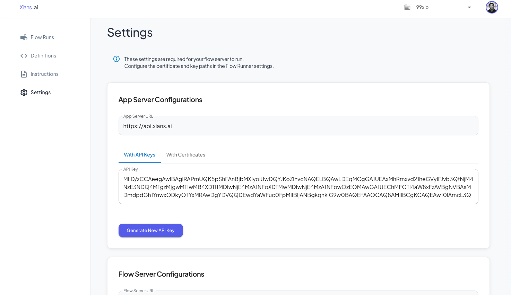

# Setting Up a Flow Project

## Prerequisites

Before you begin, ensure you have installed:

- [.NET 9 SDK](https://dotnet.microsoft.com/en-us/download/dotnet/9.0)

## Creating Your Project

Xians.ai flows run as standard .NET applications, which can be executed locally or deployed to any server environment. Let's create a new project:

```bash
dotnet new console -n MyNewXiansAiFlow
cd MyNewXiansAiFlow
```

## Installing the SDK

Add the Xians.ai SDK to your project:

```bash
dotnet add package XiansAi.Lib
```

!!! tip "Local Development"
    If you're working with a local copy of the XiansAi.Lib repository, add it as a project reference in your .csproj file:
    ```xml
    <ItemGroup>
        <ProjectReference Include="..\XiansAi.Lib\XiansAi.Lib.csproj" />
    </ItemGroup>
    ```

## Understanding the Platform

The XiansAi platform consists of two main components:

### App Server

- Manages your flows and instructions
- Provides monitoring and visualization
- Handles flow administration

### Flow Server

- Executes your flows
- Manages workflow state and persistence
- Handles distributed execution

## Configuration Setup

1. Download Certificates
First, visit the XiansAi portal's Settings section to download your certificates:



1. Configure Environment Variables
Add the following configuration to your Program.cs file to configure the `FlowRunnerService` with XiansAi platform.

`Program.cs >`

```csharp
using XiansAi.Flow;

Environment.SetEnvironmentVariable("APP_SERVER_URL", "<your-app-server-url>");
Environment.SetEnvironmentVariable("APP_SERVER_CERT_PATH", "<your-app-server-cert-path>");
Environment.SetEnvironmentVariable("APP_SERVER_CERT_PWD", "<your-app-server-cert-pwd>");
Environment.SetEnvironmentVariable("FLOW_SERVER_URL", "<your-flow-server-url>");
Environment.SetEnvironmentVariable("FLOW_SERVER_NAMESPACE", "<your-flow-server-namespace>");
Environment.SetEnvironmentVariable("FLOW_SERVER_CERT_PATH", "<your-flow-server-cert-path>");
Environment.SetEnvironmentVariable("FLOW_SERVER_PRIVATE_KEY_PATH", "<your-flow-server-private-key-path>");

var flowRunner = new FlowRunnerService();

// Register the flow (see the next section for more details)
```

!!! tip "Using Environment Files"
    For better security and maintainability, use a .env file to manage your configuration:
    You can use a package like [DotNetEnv](https://github.com/tonerdo/dotnet-env) to load the environment variables from the `.env` file without hardcoding them in your code.

    `.env file >`
    ``` .env
    # Platform environment variables
    FLOW_SERVER_URL=tenant-xyz.ozqzb.tmprl.cloud:7233
    FLOW_SERVER_NAMESPACE=tenant-xyz.ozqzb
    FLOW_SERVER_CERT_PATH=./.cert/FlowServerCert-1736928807581.crt
    FLOW_SERVER_PRIVATE_KEY_PATH=./.cert/FlowServerPrivateKey-1736928808385.key
    APP_SERVER_URL=https://api.xians.ai
    APP_SERVER_CERT_PATH=./.cert/AppServerCert-1736979268735.pfx
    APP_SERVER_CERT_PWD=test
    ```
    Update your Program.cs:
    `Program.cs >`
    ```csharp
    using XiansAi.Flow;
    using DotNetEnv;
    // Load the environment variables from the .env file
    Env.Load();
    var flowRunner = new FlowRunnerService();
    ```

## Validating Your Setup

Test your configuration:

```csharp
...
var flowRunner = new FlowRunnerService();
await flowRunner.TestMe(); // temp method to validate the configuration
```

Run the application:

```bash
dotnet run
```

If no errors occur, your setup is complete. Remember to remove the `TestMe()` call after validation.

!!! warning "Troubleshooting"
    Common issues include:

    - Incorrect certificate paths
    - Missing environment variables
    - Invalid credentials

## Next Steps

With your environment configured, you're ready to [create your first flow](2-first-flow.md).
