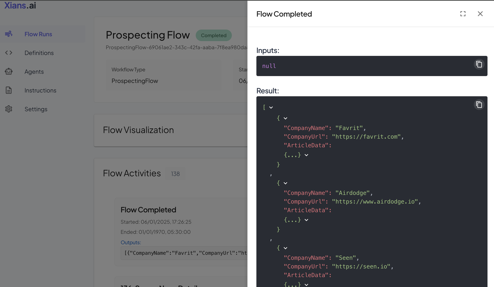

# Flow Activities

## What are Activities?

Activities are the building blocks of a flow. They are the steps that are executed in a flow. Activities are defined as interfaces and implemented by classes.

The `Flow` class is the main class that defines the flow. It contains the activities that are executed in the flow. `Flow` class is limited in it capabilities. It cannot perform any IO such as reading from a file or database. You can consider it as a `configuration file` of the flow, just that we have a full power of a programming language at our disposal.

!!! info "Flow Constraints"
    Flow.ai uses the [Temporal](https://temporal.io/) services to run flows. Temporal is an workflow engine system that allows you to run long running, robust and reliable flows. You can read more about Flow constraints [here](https://docs.temporal.io/workflows).

You can create a new flow by creating a new class that inherits from `XiansAi.Flow.FlowBase`.

!!! note "Teaser Tip"
    We are creating a simple flow. We will learn about more complex and meaningful flows that users `Agents` and `Instructions` in the next sections.

`SimpleFlow.cs >`

```csharp
using Temporalio.Workflows;
using XiansAi.Flow;

[Workflow]
public class SimpleFlow: FlowBase
{
    [WorkflowRun]
    public async Task<string> Run(string name)
    {
        return $"Hello {name}";
    }
}
```

## Registering the Flow

To register the flow, you need to add the new flow to Flow Runner on your `Program.cs` file. Update the `Program.cs` file with the following code:

`Program.cs >`

```csharp
using XiansAi.Flow;

// TODO: Get these values from the XiansAI portal
var config = ...

// Runner for the flow
var flowRunner = new FlowRunnerService(config);

// Define the flow
var flowInfo = new FlowInfo<SimpleFlow>();

// Add activities to the flow
flowInfo.AddActivity<IActivityOne>(new ActivityOne());
flowInfo.AddActivity<IActivityTwo>(new ActivityTwo());

// Run the flow
Task simpleFlowTask = flowRunner.RunFlowAsync(flowInfo, CancellationToken.None);

// Wait for the flow to complete
await simpleFlowTask;


```

## Configuring flow visualization

You need to configure bundling the source code of the flow file into the assembly. This is done by adding the following to your `csproj` file:

```xml
  <ItemGroup>
    <!-- Embed the flow source files -->
    <EmbeddedResource Include="SimpleFlow.cs">
        <!-- Keep the resource name simple since files are in root -->
        <LogicalName>%(Filename)%(Extension)</LogicalName>
    </EmbeddedResource>
  </ItemGroup>
```

It is recommended to keep the flow files on the root of the project.

## Running the Flow

To run the flow, you can run the following command:

```bash
dotnet build    
dotnet run
```

Program now waits to run the flows you are starting. You can start a new flow on the XiansAI portal by visiting the 'Flow Definitions' section and clicking on the 'Start New' button of your new flow Type (SimpleFlow).


## Monitoring the Flow

You can monitor the flow by visiting the 'Flow Runs' section of the XiansAI portal.


You can see the flow run details by clicking on the flow run id. For activities, you are able to see details such as:

- Activity Inputs
- Activity Outputs
- Activity Start Time
- Activity End Time
- Activity Instructions
- Activity Agents


